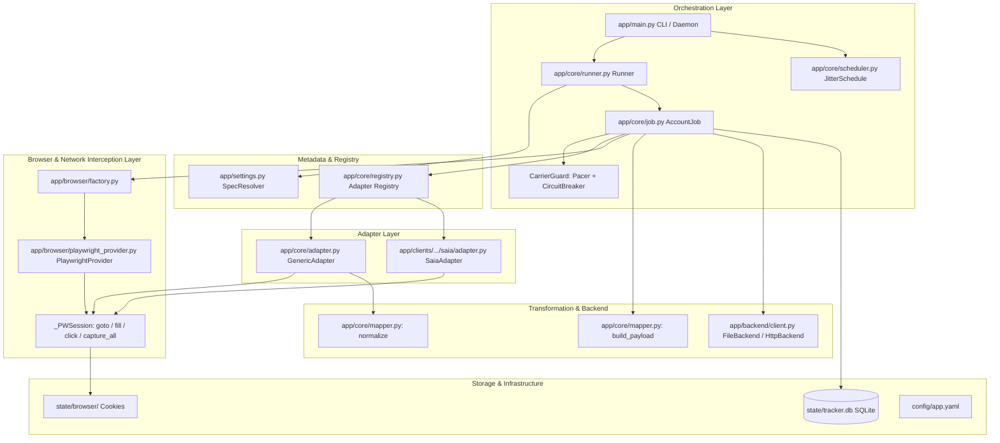
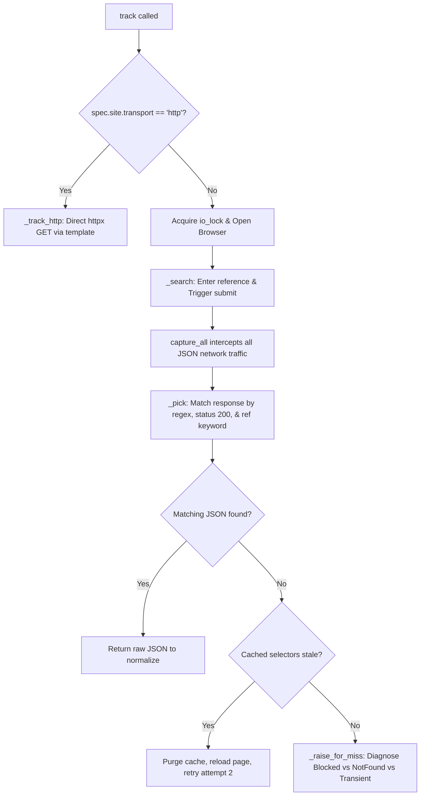
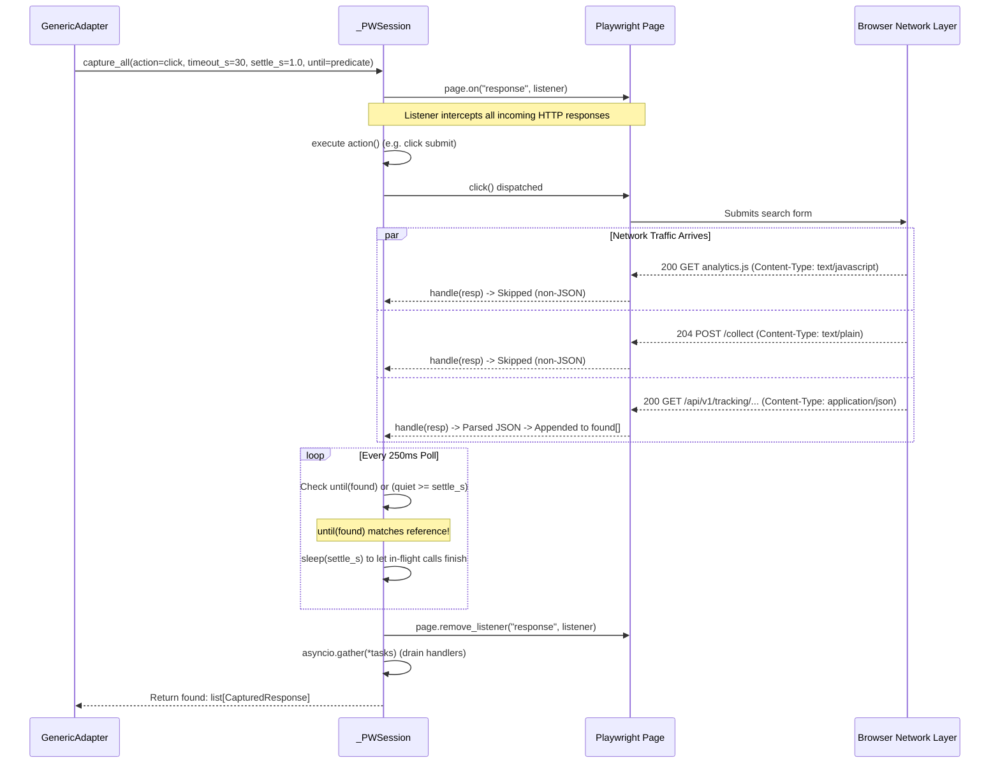
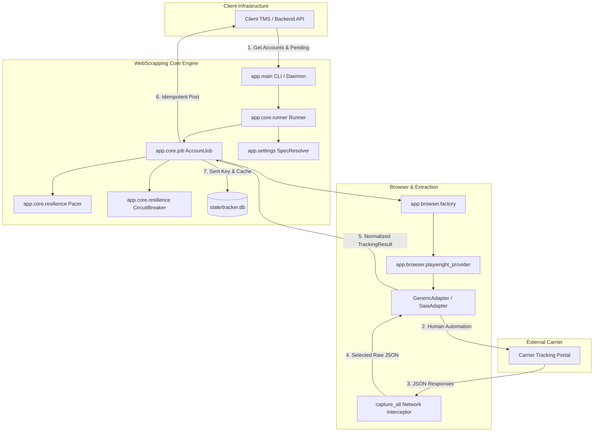
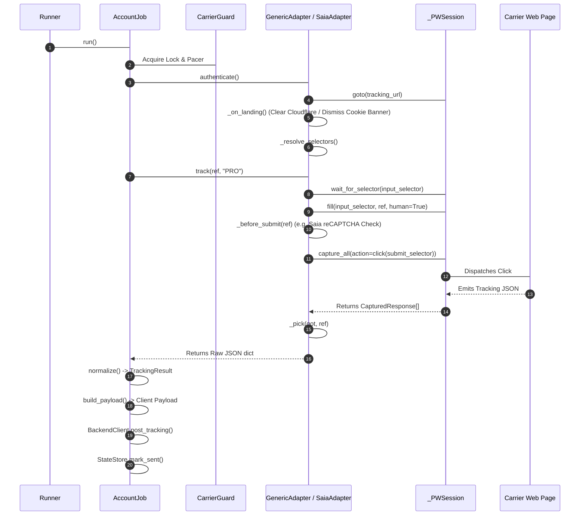
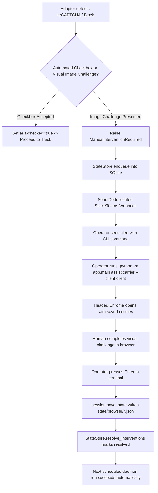

# WebScrapping Technical Architecture

> **Document Version:** 2.0.0  
> **Last Updated:** 2026-10-05  
> **Author:** Antigravity AI Engineering & Architecture Team  
> **Status:** Production Reference & System Blueprint  

---

## Table of Contents
1. [Project Overview](#1-project-overview)
2. [What Problem This Project Solves](#2-what-problem-this-project-solves)
3. [Architecture Overview](#3-architecture-overview)
4. [Repository Structure](#4-repository-structure)
5. [File-by-File Guide](#5-file-by-file-guide)
6. [Core Classes](#6-core-classes)
7. [End-to-End Request Flow](#7-end-to-end-request-flow)
8. [Browser Automation](#8-browser-automation)
9. [Scraping Mechanism](#9-scraping-mechanism)
10. [Network Response Capture](#10-network-response-capture)
11. [Response Selection](#11-response-selection)
12. [Response Extraction](#12-response-extraction)
13. [Normalization](#13-normalization)
14. [Saia Implementation](#14-saia-implementation)
15. [Estes Implementation](#15-estes-implementation)
16. [Configuration and Mapping](#16-configuration-and-mapping)
17. [Client/Carrier Architecture](#17-clientcarrier-architecture)
18. [Patchright](#18-patchright)
19. [Playwright MCP](#19-playwright-mcp)
20. [CAPTCHA and Human Intervention](#20-captcha-and-human-intervention)
21. [Resilience and Error Handling](#21-resilience-and-error-handling)
22. [Adding a New Carrier](#22-adding-a-new-carrier)
23. [Debugging Guide](#23-debugging-guide)
24. [Testing Strategy](#24-testing-strategy)
25. [Current Limitations](#25-current-limitations)
26. [Technical Debt](#26-technical-debt)
27. [Architecture Decisions](#27-architecture-decisions)
28. [Sequence Diagrams](#28-sequence-diagrams)
29. [Glossary](#29-glossary)
30. [Quick Reference](#30-quick-reference)

---

## 1. Project Overview

The **WebScrapping** repository is an enterprise-grade, asynchronous freight tracking pipeline designed to extract shipment tracking milestones from Less-Than-Truckload (LTL) and parcel motor freight carriers. It operates as an automated bridge between a shipper's enterprise resource planning (ERP) / transportation management system (TMS) and public web tracking portals.

### High-Level Architecture Model


### Key Capabilities
- **Multi-Tenant Client & Carrier Hierarchy:** Organizes configuration strictly under `app/clients/<client>/carriers/<carrier>/` allowing client-specific billing codes (`billTo`), payload formats, and credentials to coexist cleanly.
- **Network Response Interception over DOM Scraping:** Rather than querying volatile HTML elements, the engine acts as an authentic browser user, waits for the web application (Angular, React, Vue, Salesforce Lightning) to make its internal telemetry/API calls, and captures the raw, pristine JSON response directly from the network layer.
- **Generic Automation Engine (`GenericAdapter`):** Handles navigation, cookie consent dismissal, input locating, form typing, submission, network capture, response selection, and normalization out-of-the-box for 90%+ of carriers with zero custom Python code.
- **Subclass Extension Hooks:** Complex carriers with bot defenses (e.g., Saia with Cloudflare Turnstile and Google reCAPTCHA v2) only override surgical lifecycle hooks (`_on_landing`, `_before_submit`) rather than duplicating the tracking lifecycle.
- **Anti-Bot Stealth Execution:** Employs **Patchright** (an undetected Chromium fork that patches C++ Chrome DevTools Protocol automation indicators) and persistent session storage states (`storage_state`) to maintain cookie authorization and avoid bot hurdles.
- **Semi-Automated Human Intervention Loop:** When automated CAPTCHA challenges require human visual perception (image puzzles), the system halts gracefully, records an incident in SQLite, triggers deduplicated webhook alerts, and provides a headed CLI assist tool (`python -m app.main assist <carrier> --client <client>`) to let a human solve the puzzle once and save the session.

---

## 2. What Problem This Project Solves

### The Freight Tracking Dilemma
In North American freight logistics (LTL), shippers generate thousands of freight shipments daily across hundreds of independent motor carriers (e.g., Saia, Estes Express, Forward Air, Old Dominion, R+L Carriers).
1. **Lack of Open APIs:** The vast majority of freight carriers do not offer open public REST APIs. Their B2B APIs require protracted sales contracts, expensive EDI 214 transactions, or complex enterprise credentialing.
2. **Encrypted Parameters & Anti-Bot Walls:** Carriers protect their public web tracking pages behind bot protection platforms (Cloudflare, Akamai, Datadome, Google reCAPTCHA) and encrypt internal API parameters (such as Saia's encrypted `proNumbers` query token) to actively prevent headless `curl` or `requests` scrapers.
3. **Single Page Application (SPA) Complexity:** Modern carrier tracking pages are complex dynamic SPAs. Form elements are dynamically attached, validation rules run asynchronously, and tracking data is rendered inside deeply nested Shadow DOMs or dynamically hydrated virtual DOMs. Traditional scrapers (BeautifulSoup, Scrapy) fail because HTML markup changes constantly.

### The Architectural Solution
WebScrapping solves this by combining:
1. **Authentic Browser Emulation:** Using Patchright with randomized human keystroke pacing and natural cursor clicks to satisfy client-side JavaScript challenges and security tokens.
2. **Internal API Hijacking:** Letting the carrier's own frontend JavaScript encrypt query parameters, pass CSRF tokens, and submit tracking requests, while our browser sniffs the underlying HTTP 200 JSON response emitted back to the SPA.
3. **Canonical Normalization:** Converting divergent carrier JSON formats (flat records, nested trees, timestamp variants) into a unified, strongly-typed Pydantic model (`TrackingResult`).

---

## 3. Architecture Overview

The system is organized into decoupled layers following clean architecture principles:



### Communication Contracts
1. **Entry Point to Runner:** `Runner.run_once()` receives optional filters (`only_carriers`, `only_clients`, `force`).
2. **Runner to Backend Client:** Fetches active `CarrierAccount` records from `BackendClient.get_carrier_accounts()`.
3. **Spec Resolution:** `SpecResolver.resolve(bill_to, carrier_code)` resolves the hierarchical `CarrierSpec` by merging `client.yaml` defaults with carrier `mapping.yaml`.
4. **Execution Safety:** Each carrier domain is protected by a singleton `CarrierGuard` containing an `asyncio.Semaphore` / `Pacer` (rate-limiting requests with randomized jitter) and a `CircuitBreaker` (tripping on consecutive 403/429 blocks).
5. **Adapter Selection:** `registry.get_adapter_class()` discovers whether a custom `CarrierAdapter` subclass exists in the carrier's directory; otherwise, it falls back to `GenericAdapter`.
6. **Browser Session Lifecycle:** The provider launches Patchright/Playwright, loads saved cookies from `state/browser/<client>_<carrier>.json`, executes the search, and closes the browser context cleanly.
7. **Two-Stage Mapping:**
   - **Stage 1 (Carrier -> Canonical):** `mapper.normalize()` parses raw carrier JSON into `TrackingResult` using dot-notation paths (`fields`) and fuzzy keyword heuristics (`auto`).
   - **Stage 2 (Canonical -> Client TMS):** `mapper.build_payload()` translates `TrackingResult` into the target client payload dictionary using `client.yaml:payload_map` and optional `hooks.py:post()`.
8. **Idempotent Delivery:** Hashes the shipment body via SHA1 (`idempotency_key`). Unchanged tracking results are marked skipped; modified shipments are delivered via `BackendClient.post_tracking()` and recorded in SQLite.

---

## 4. Repository Structure

### Complete Workspace Inventory

| Path | Category | Status | Description |
| :--- | :--- | :--- | :--- |
| `main.py` | Root Stub | **Unused / Dead** | Scaffolded hello-world stub (`def main(): print("Hello from webscrapping!")`). Production CLI is in `app/main.py`. |
| `pyproject.toml` | Build Config | Production | Project dependencies, Python `>=3.13`, tool configs for `pytest` and `uv`. |
| `requirements.txt` | Build Config | Production | Pinned requirements for containerized/virtual environments. |
| `README.md` | Documentation | Stale Reference | Project overview; references `config.yaml` instead of `mapping.yaml`. |
| `.gitignore` | VCS Config | Production | Excludes python caches, virtualenvs, `.playwright-mcp/`, state files. |
| `config/app.yaml` | Configuration | Production | Global runtime configuration: logging, DB paths, scheduler jitter, backend mode. |
| `app/main.py` | Entry Point | Production | CLI composition root: `run-once`, `daemon`, `assist`. |
| `app/settings.py` | Core Config | Production | Pydantic configuration schemas (`AppSettings`, `CarrierSpec`, `SiteConfig`, etc.) and `load_resolver()`. |
| `app/models.py` | Core Models | Production | Pydantic data models: `CarrierAccount`, `PendingRef`, `TrackingResult`, `TrackingEvent`. |
| `app/logging_setup.py` | Infrastructure | Production | Structured JSON logging with contextvars (`run_id`, `client`, `carrier`) and secret redaction. |
| `app/backend/client.py` | Backend I/O | Production | Abstraction over TMS backend APIs (`FileBackend` for local stubs, `HttpBackend` for live REST). |
| `app/browser/base.py` | Browser Base | Production | Abstract interfaces: `BrowserProvider`, `BrowserSession`, `CapturedResponse`. |
| `app/browser/playwright_provider.py` | Browser Impl | Production | Concrete Playwright and Patchright session management, DOM interactions, and network sniffer (`capture_all`). |
| `app/browser/factory.py` | Browser Factory| Production | Instantiates `PlaywrightProvider` or stubs based on `BrowserConfig.provider`. |
| `app/browser/crawl4ai_provider.py`| Browser Stub | **Incomplete** | Fallback stub for Crawl4AI; currently raises `NotImplementedError`. |
| `app/core/adapter.py` | Core Adapter | Production | `CarrierAdapter` ABC, `GenericAdapter` implementation, search discovery, retry loop, and response picker (`_pick`). |
| `app/core/registry.py` | Core Registry | Production | Dynamic adapter discovery (`discover()`) scanning `app/clients/**/adapter.py`. |
| `app/core/runner.py` | Orchestration | Production | Batch runner: queries accounts, resolves specs, groups jobs, manages concurrency and metrics. |
| `app/core/job.py` | Job Engine | Production | `AccountJob`: executes per-(billTo, carrier) workflow: pending -> auth -> track -> normalize -> post. |
| `app/core/resilience.py` | Fault Tolerance| Production | `retry()` with full jitter, `Pacer` rate-limiter, `CircuitBreaker`, and exception taxonomy. |
| `app/core/scheduler.py` | Scheduling | Production | `JitterSchedule`: deterministic anchored slot scheduling to prevent cadence drift. |
| `app/core/state.py` | Persistence | Production | `StateStore`: SQLite database (`sent` tracking, `kv` cache, `intervention` queue). |
| `app/core/intervention.py` | Human-in-the-Loop| Production | `InterventionQueue`: records manual intervention tasks and emits deduplicated alerts. |
| `app/core/metrics.py` | Observability | Production | `RunMetrics`: tracks operational counters (success, failed, blocked, not_found) and latencies. |
| `app/core/mapper.py` | Transformation | Production | Two-stage normalization engine: `get_path()`, `auto_fields()`, `status_from_text()`, `normalize()`, `build_payload()`. |
| `app/clients/calix/client.yaml` | Client Config | Production | Client configuration for Calix: billTo mapping, pending API schema, payload mapping. |
| `app/clients/calix/carriers/estes/mapping.yaml` | Carrier Config | Production | Estes Express configuration: aliases, selectors, field mappings. |
| `app/clients/calix/carriers/estes/hooks.py` | Post-Hook | Production | Custom payload adjustments for Calix x Estes (e.g. housebill assignment, date trimming). |
| `app/clients/calix/carriers/saia/mapping.yaml` | Carrier Config | Production | Saia configuration: Patchright browser settings, selectors, regex, fields, status map. |
| `app/clients/calix/carriers/saia/adapter.py` | Carrier Adapter| Production | `SaiaAdapter`: custom Cloudflare bypass, reCAPTCHA v2 iframe handling, manual challenge detection. |
| `app/clients/calix/carriers/forwardair/mapping.yaml` | Carrier Config | Production | Forward Air configuration: Patchright settings, pinned selectors, OneTrust cookie handling. |
| `scripts/probe.py` | Debugging Tool | Development | Live testing CLI: runs a single PRO against an adapter, prints raw JSON, normalized model, payload. |
| `scripts/new_carrier.py`| Scaffolding | Development | Scaffolds a new carrier folder (`mapping.yaml`, optional `adapter.py`). |
| `scripts/new_client.py` | Scaffolding | Development | Scaffolds a new client folder (`client.yaml`, `carriers/`). |
| `tests/test_core.py` | Unit Tests | **Broken / Stale** | Outdated test suite referencing legacy modules (`postprocess.py`, `EstesAdapter`). |
| `tests/fixtures/estes_response.json` | Test Fixture | Test Data | Real-world Estes tracking JSON fixture for offline parser testing. |
| `stub/carriers.json` | Test Stub | Test Data | Local mock data for `FileBackend.get_carrier_accounts()`. |
| `stub/pending/CALIX_ESTES.json` | Test Stub | Test Data | Local mock data for `FileBackend.get_pending()`. |
| `templates/adapter.py.tmpl` | Template | **Stale** | Scaffolding template referencing deprecated `capture_json()` method. |
| `templates/carrier_config.yaml.tmpl` | Template | **Stale** | Scaffolding template using outdated YAML key names (`adapter:`, `normalize:`). |
| `templates/hooks.py.tmpl` | Template | Production | Scaffolding template for carrier `post()` hook. |
| `state/tracker.db` | Runtime State | Local Database | SQLite state store for idempotency keys, key-value cache, and interventions. |
| `state/browser/*.json` | Runtime State | Local Storage | Serialized browser cookie jars and storage states (`calix_SAIA.json`, etc.). |

---

## 5. File-by-File Guide

### `app/main.py`
- **Purpose:** Central application composition root and Command-Line Interface (CLI).
- **Used by:** Operators, systemd/supervisord daemons, cron jobs, debugging scripts.
- **Important Functions:**
  - `build(args)`: Initializes global settings, logging, SQLite state store, backend client, and builds `Runner`.
  - `run-once`: Executes an immediate batch for specified `--client` and `--carrier`.
  - `daemon`: Runs an infinite background loop using `JitterSchedule`.
  - `assist`: Launches a headed browser session with persistent cookies, allowing an operator to solve a challenge manually.
- **Failure Modes:** Fails with exit code 1 if `--client` or `--carrier` cannot be resolved against `SpecResolver`.

### `app/settings.py`
- **Purpose:** Configuration loading, validation, and hierarchical resolution engine.
- **Important Classes:** `AppSettings`, `BrowserConfig`, `Limits`, `SiteConfig`, `MappingConfig`, `CarrierSpec`, `SpecResolver`.
- **Important Functions:**
  - `load_settings(path)`: Loads root `config/app.yaml`.
  - `load_resolver(clients_dir)`: Traverses `app/clients/`, parses each `client.yaml`, recursively merges `defaults` with carrier `mapping.yaml` files, and builds `SpecResolver`.
  - `_merge(a, b)`: Deep merges dictionaries while overwriting scalars and lists.
- **Failure Modes:** Rejects unrecognized YAML keys using Pydantic's `extra="forbid"`. Config errors in one carrier do not prevent others from loading (appends to `res.errors`).

### `app/models.py`
- **Purpose:** Domain data contracts and serialization schemas.
- **Important Classes:**
  - `CarrierAccount`: Represents a carrier account from the backend (credentials, `tracking_url`, frequencies).
  - `PendingRef`: A single PRO / BOL / Tracking number waiting to be tracked.
  - `PendingBatch`: A collection of `PendingRef` objects for a specific client/carrier.
  - `TrackingEvent`: Single history event (`timestamp`, `description`, `location`, `status`).
  - `TrackingResult`: The canonical normalized tracking object. Sanitizes weight and pieces into numeric floats/ints via field validators.

### `app/logging_setup.py`
- **Purpose:** Production JSON logging formatter with context propagation and secret masking.
- **Important Components:**
  - `run_id_var`, `carrier_var`, `client_var`: Python `contextvars` providing distributed tracing metadata.
  - `register_secret(value)`: Globally registers passwords or tokens for scrubbing.
  - `redact(text)`: Regex and set-based scrubber replacing secrets, cookies, tokens, and authorization headers with `***`.
  - `JsonFormatter`: Outputs single-line JSON records formatted for Datadog, ELK, or CloudWatch.

### `app/backend/client.py`
- **Purpose:** Abstract communication interface to upstream TMS / ERP backends.
- **Important Classes:**
  - `BackendClient`: Abstract interface (`get_carrier_accounts`, `get_pending`, `post_tracking`).
  - `FileBackend`: Development/test implementation operating on `stub/carriers.json`, `stub/pending/*.json`, and `out/<run_id>/`.
  - `HttpBackend`: Production implementation interacting with live REST APIs with Bearer token authentication.
  - `parse_pending(data, account, spec)`: Config-driven parser mapping custom backend JSON structures to `PendingBatch`.

### `app/browser/base.py`
- **Purpose:** Engine-agnostic browser interfaces and data structures.
- **Important Classes:**
  - `CapturedResponse`: Dataclass holding `url`, `status`, and parsed `json` data.
  - `BrowserSession`: Abstract browser interaction contract (`goto`, `fill`, `click`, `press`, `select_option`, `wait_for_selector`, `is_visible`, `evaluate`, `discover_search_box`, `capture_all`, `looks_blocked`, `save_state`, `close`).
  - `BrowserProvider`: Factory creating named, state-persisted `BrowserSession` instances.

### `app/browser/playwright_provider.py`
- **Purpose:** Production browser implementation supporting Playwright and Patchright.
- **Important Classes:**
  - `PlaywrightProvider`: Manages Chromium subprocess lifecycle. Configures proxy, viewport, timezone, locale, and launch arguments (`--disable-blink-features=AutomationControlled`).
  - `_PWSession`: Implements `BrowserSession`. Supports human typing simulation (`press_sequentially` with 45–140ms delays) and frame-targeted interactions (`frame_locator`).
  - `_DISCOVER_JS`: Client-side JavaScript snippet analyzing input tags, keyword relevance (`pro`, `track`, `bol`), form proximity, and visibility to discover tracking boxes automatically.
  - `capture_all()`: Core network sniffer registering `page.on("response")` to intercept and parse JSON responses emitted during an action.

### `app/core/adapter.py`
- **Purpose:** Adapter interface definitions and the generic scraping workflow.
- **Important Classes:**
  - `CarrierAdapter`: Abstract base class defining `authenticate()`, `track()`, `normalize()`, and `close()`.
  - `GenericAdapter`: Default implementation. Drives the search box, manages cookie consent, runs submit retries, listens to network responses, picks the relevant JSON, and raises classified exceptions.
- **Important Functions:**
  - `_contains_ref(obj, key)`: Recursive deep search verifying whether a JSON structure contains the cleaned tracking number.
  - `_pick(got, ref)`: Filters candidate responses by status 200, JSON type, regex match, and reference containment, returning the richest payload.

### `app/core/registry.py`
- **Purpose:** Dynamic discovery and factory for carrier adapters.
- **Important Functions:**
  - `discover()`: Uses `pkgutil.walk_packages` to import all modules matching `app.clients.<client>.carriers.<carrier>.adapter`. Auto-registers `CarrierAdapter` subclasses.
  - `get_adapter_class(code, client)`: Looks up registered adapter; defaults to `GenericAdapter` if no custom class exists.

### `app/core/runner.py`
- **Purpose:** Multi-account orchestration engine.
- **Important Classes:** `Runner`.
- **Detailed Behavior:**
  - Fetches carrier accounts from the backend.
  - Filters active accounts and resolves matching `CarrierSpec` configs.
  - Applies frequency schedule checks (`_due()`).
  - Instantiates per-carrier concurrency guards (`CarrierGuard`).
  - Spawns concurrent `AccountJob` instances via `asyncio.gather(..., return_exceptions=True)`.

### `app/core/job.py`
- **Purpose:** Manages the lifecycle of tracking a single `(billTo, carrier)` batch.
- **Important Classes:** `AccountJob`.
- **Workflow:** Checks circuit breaker -> retrieves pending references -> authenticates adapter -> tracks each reference sequentially through the `Pacer` -> normalizes result -> builds client payload -> sends batch to backend -> records idempotency keys.

### `app/core/resilience.py`
- **Purpose:** Fault tolerance, pacing, and error classification.
- **Important Classes & Functions:**
  - `retry(fn, attempts, base, cap, retry_on)`: Asynchronous exponential backoff with full randomization jitter.
  - `Pacer`: Concurrency limiter (`asyncio.Semaphore`) combined with randomized time spacing between search starts.
  - `CircuitBreaker`: Three-state circuit breaker (`closed`, `open`, `half-open`) to protect carrier portals from excessive traffic during bot blocks.
  - Exceptions: `TransientError`, `BlockedError`, `NotFoundError`, `ManualInterventionRequired`.

### `app/core/state.py`
- **Purpose:** Embedded SQLite persistence layer.
- **Important Classes:**
  - `StateStore`: Manages tables `sent` (idempotency timestamps), `kv` (general key-value storage), and `intervention` (manual challenge queues).
  - `KVCache`: Lightweight adapter cache interface isolating adapters from direct SQL access.

### `app/core/mapper.py`
- **Purpose:** Pure data transformation engine (zero I/O).
- **Important Functions:**
  - `get_path(obj, path, default)`: Deep path extractor supporting dot notation (`a.b.c`), list indexes (`results.0.status`), bracket syntax (`[0].status`), single-key dictionary unwrapping, and pipe fallbacks (`a.b|c.d`).
  - `auto_fields(raw)`: Uses precompiled regular expressions against flattened scalar leaves to detect `status`, `delivery_date`, `eta`, `weight`, and `pieces`.
  - `status_from_text(text, status_map)`: Maps raw carrier status strings to canonical status enum values.
  - `normalize(spec, raw, ref, ref_type, account)`: Transforms raw JSON into `TrackingResult`.
  - `build_payload(spec, result, account, run_id, meta)`: Transforms `TrackingResult` into client-specific JSON.

---

## 6. Core Classes

### Architectural Responsibilities

```
+-----------------------------------------------------------------------+
|                             CarrierAdapter                            |
|  - Defines interface: authenticate(), track(), normalize(), close()   |
|  - Holds: spec, account, browser provider, cache, io_lock             |
+-----------------------------------+-----------------------------------+
                                    |
                                    v
+-----------------------------------------------------------------------+
|                             GenericAdapter                            |
|  - Automates standard carrier tracking pages                          |
|  - Auto-resolves search input and submit buttons                      |
|  - Dismisses cookie banners                                           |
|  - Orchestrates _search(), capture_all(), _pick()                     |
|  - Hooks: _on_landing(), _before_submit()                             |
+-----------------------------------+-----------------------------------+
                                    |
                                    v
+-----------------------------------------------------------------------+
|                              SaiaAdapter                              |
|  - Overrides _on_landing(): Cloudflare challenge waiting & login      |
|  - Overrides _before_submit(): reCAPTCHA v2 iframe resolution         |
|  - Detects interactive image challenges -> ManualInterventionRequired |
+-----------------------------------------------------------------------+
```

### Detailed Class Breakdown

#### 1. `CarrierAdapter` & `GenericAdapter` (`app/core/adapter.py`)
- **Responsibility:** Orchestrating browser actions for a carrier and returning raw tracking JSON.
- **Constructor Dependencies:** `spec: CarrierSpec`, `account: CarrierAccount`, `browser: BrowserProvider`, `cache: Cache`.
- **Key Methods:**
  - `authenticate()`: Navigates to the tracking URL, runs `_on_landing()`, and resolves selectors.
  - `track(ref, ref_type)`: Executes `_search()` inside an `asyncio.Lock`, picks candidate JSON with `_pick()`, and handles retries.
  - `_before_submit(ref)`: Extension point called after entering the tracking number and before clicking submit.

#### 2. `SaiaAdapter` (`app/clients/calix/carriers/saia/adapter.py`)
- **Responsibility:** Handling Saia's specific bot protections (Cloudflare Managed Challenges and Google reCAPTCHA v2).
- **Key Methods:**
  - `_on_landing()`: Polls `looks_blocked()` up to `challenge_wait_s` to allow Cloudflare Turnstile to clear automatically. Handles optional account login.
  - `_before_submit(ref)`: Calls `_handle_recaptcha()`.
  - `_handle_recaptcha()`: Locates `iframe[title="reCAPTCHA"]:visible`, clicks the checkbox (`#recaptcha-anchor`), polls for token generation (`#g-recaptcha-response`), and inspects bframe popups to raise `ManualInterventionRequired` if an image puzzle appears.

#### 3. `BrowserSession` & `_PWSession` (`app/browser/playwright_provider.py`)
- **Responsibility:** High-level browser control wrapper over Playwright/Patchright `Page` and `BrowserContext`.
- **Key Methods:**
  - `goto(url)`: Navigates to URL and introduces human-like settle delays.
  - `fill(selector, value, human=True)`: Simulates real keystroke delays using `press_sequentially`.
  - `capture_all(action, timeout_s, settle_s, until)`: Wraps an action in an asynchronous network listener and collects all JSON responses.

#### 4. `SpecResolver` (`app/settings.py`)
- **Responsibility:** Resolving client/carrier configurations dynamically from filesystem layouts.
- **Key Methods:**
  - `resolve(bill_to, code) -> CarrierSpec | None`: Resolves by client billing code and carrier code/alias.

---

## 7. End-to-End Request Flow

The following trace details the execution of tracking **Saia PRO `77133675090`** for client **Calix**:

```
[1. User/CLI Invocation]
       |  python -m app.main run-once --client calix --carrier saia --force
       v
[2. App Bootstrap]
       |  build() -> load_settings() -> setup_logging() -> discover() adapters
       v
[3. Spec Resolution]
       |  SpecResolver resolves ("CALIX", "SAIA") -> CarrierSpec
       |  mapping.yaml merged with calix/client.yaml defaults
       v
[4. Account Fetch & Guarding]
       |  BackendClient.get_carrier_accounts() -> CarrierAccount(carrierCode="SAIA", billTo="CALIX")
       |  CarrierGuard allocated: Pacer(min=8s, max=20s), CircuitBreaker(thresh=3, cd=3600s)
       v
[5. Job Execution (AccountJob.run)]
       |  BackendClient.get_pending() -> PendingBatch(refs=[PendingRef("77133675090", "PRO")])
       |  Registry resolves SaiaAdapter class
       v
[6. Adapter Authentication (SaiaAdapter.authenticate)]
       |  BrowserProvider.open_session("calix_SAIA") loads cookies from state/browser/calix_SAIA.json
       |  session.goto("https://www.saia.com/track")
       |  _on_landing() -> _clear_challenge() polls looks_blocked()
       |  _resolve_selectors() loads #trackingNumbers and button.track-button from mapping.yaml
       v
[7. Tracking Search (SaiaAdapter.track -> _search)]
       |  session.wait_for_selector("#trackingNumbers")
       |  session.fill("#trackingNumbers", "77133675090", human=True)
       |  Hook _before_submit() triggers SaiaAdapter._handle_recaptcha()
       v
[8. reCAPTCHA Handling]
       |  Locates 'iframe[title="reCAPTCHA"]:visible'
       |  Clicks checkbox '#recaptcha-anchor'
       |  Polls for '#recaptcha-anchor[aria-checked="true"]' or '#g-recaptcha-response'
       |  Verified without image challenge -> proceed
       v
[9. Network Interception Trigger]
       |  session.capture_all(action=lambda: session.click("button.track-button"))
       |  page.on("response") listener active
       v
[10. Browser Network Emission]
       |  Saia Angular app makes GET /api/v1/tracking/find-by-pro-number?proNumbers=W8Q...
       |  Response status 200, Content-Type: application/json
       |  CapturedResponse collected
       v
[11. Response Selection (_pick)]
       |  _pick() evaluates candidate responses against regex '/api/v1/tracking/find-by-pro-number'
       |  _contains_ref() validates presence of "77133675090"
       |  Richest matching JSON returned
       v
[12. Normalization (mapper.normalize)]
       |  Extracts reference, status, dates, origin, destination, pieces, weight
       |  status_from_text("Delivered") -> "DELIVERED", delivered=True
       |  Returns canonical TrackingResult
       v
[13. Client Payload Construction (mapper.build_payload)]
       |  Transforms TrackingResult into Calix payload using client.yaml:payload_map
       |  Calculates SHA1 idempotency_key
       v
[14. Ingestion & State Update]
       |  BackendClient.post_tracking() sends payload
       |  StateStore.mark_sent(idempotency_key) commits to SQLite
       |  session.save_state() persists updated cookies
       |  session.close() releases browser context
```

---

## 8. Browser Automation

### The Browser Abstraction Layer
The application interacts with browsers exclusively through the `BrowserSession` interface in `app/browser/base.py`. This ensures that scraping logic is decoupled from Playwright, Patchright, or any future browser driver.

```
+-------------------------------------------------------------+
|                      Carrier Adapters                       |
|               (GenericAdapter, SaiaAdapter)                 |
+------------------------------+------------------------------+
                               | calls generic methods
                               v
+-------------------------------------------------------------+
|                        BrowserSession                       |
|  goto, fill, click, press, wait_for_selector, capture_all   |
+------------------------------+------------------------------+
                               | implemented by
                               v
+-------------------------------------------------------------+
|                          _PWSession                         |
+------------------------------+------------------------------+
                               | controls
                               v
+-------------------------------------------------------------+
|               Playwright / Patchright Page & Context        |
+-------------------------------------------------------------+
```

### Detailed Method Inventory

| Method | Implementation Details | Playwright/Patchright Primitive | Purpose |
| :--- | :--- | :--- | :--- |
| `goto(url)` | Navigates with `domcontentloaded`, adds 0.8–2.2s jitter delay. | `page.goto(url, wait_until="domcontentloaded")` | Opens tracking pages without triggering aggressive navigation timeouts. |
| `fill(selector, val, human)` | Targets element/frame; if `human=True`, clears and uses `press_sequentially` (45–140ms delays). | `locator.click()`, `locator.fill("")`, `locator.press_sequentially()` | Simulates human typing to satisfy anti-bot cadence analysis. |
| `click(selector, frame)` | Sleeps 0.3–0.9s, resolves target locator or frame locator, clicks. | `locator.click()` | Dispatches real DOM click events. |
| `press(selector, key)` | Sleeps 0.3–0.9s, presses specific keyboard key. | `locator.press(key)` | Dispatches Enter/Tab keys. |
| `select_option(sel, val)` | Resolves `<select>` element and selects option. | `locator.select_option(val)` | Selects dropdown options (e.g. PRO vs BOL). |
| `wait_for_selector(sel)` | Waits for element state to reach `"attached"`. | `locator.wait_for(state="attached")` | Verifies presence of elements without throwing unhandled exceptions. |
| `is_visible(sel, frame)` | Checks element visibility. | `locator.is_visible()` | Detects active CAPTCHAs, error modals, or cookie banners. |
| `evaluate(expression)` | Executes JavaScript in page execution context. | `page.evaluate(expression)` | DOM sniffing, property extraction, custom challenge verification. |
| `discover_search_box()` | Runs `_DISCOVER_JS` in browser context. | `page.evaluate(_DISCOVER_JS)` | Auto-discovers input boxes and submit buttons using scoring heuristics. |
| `capture_all(action, ...)`| Registers response handler, runs action, polls until condition met. | `page.on("response")`, `page.remove_listener()` | Sniffs network JSON traffic during form submission. |
| `looks_blocked(markers)` | Inspects page title and body text for Cloudflare / block keywords. | `page.title()`, `page.inner_text("body")` | Detects bot challenge screens. |
| `save_state()` | Dumps cookies and local storage to JSON on disk. | `context.storage_state(path=...)` | Preserves authenticated sessions between scheduled runs. |
| `close()` | Calls `save_state()` and closes browser context. | `context.close()` | Frees memory and browser processes. |

---

## 9. Scraping Mechanism

### Comparison of Extraction Techniques

| Extraction Technique | Used in WebScrapping? | When Used? | Pros / Cons |
| :--- | :--- | :--- | :--- |
| **A. HTML DOM Scraping** | **No (Avoided)** | Never used for tracking extraction. | **Cons:** Extreme fragility. SPAs re-render and obfuscate class names (`.css-2bxn45`), breaking CSS selectors constantly. |
| **B. Page User Interaction** | **Yes** | Always used for navigation, typing PROs, dismissing banners, and clicking submit. | **Pros:** Executes client-side JavaScript, generates CSRF tokens, passes browser environment checks. |
| **C. Network Response Capture** | **Yes (Primary)** | Primary extraction mechanism for all modern carriers. | **Pros:** Captures pure, structured JSON payloads directly from carrier APIs. Unaffected by frontend UI redesigns. |
| **D. Direct HTTP Transport** | **Yes (Optional)** | Only when `transport: http` is explicitly configured in `mapping.yaml`. | **Pros:** Maximum speed, zero browser overhead. **Cons:** Only works on carriers without bot walls or session tokens. |

### Decision Flow in `GenericAdapter`



---

## 10. Network Response Capture

### Detailed Mechanics of `capture_all()`
The `capture_all` method in `app/browser/playwright_provider.py` captures asynchronous JSON payloads reliably.



### Response Handling Edge Cases
- **Content-Type Validation:** Evaluates `("json" in content_type or content_type.endswith("+json"))`. Non-JSON responses (images, CSS, JS bundles, HTML pages) are discarded immediately without consuming memory.
- **Malformed JSON:** If `resp.json()` throws an exception (e.g. truncated chunks or server errors returning HTML error pages with JSON headers), the error is caught, logged, and ignored.
- **Multiple JSON Calls:** If the page issues multiple JSON requests (e.g., user profiles, tracking summaries, and detailed milestone histories), `capture_all()` captures **all** of them into `found`. The `_pick()` method is responsible for selecting the correct one.
- **Listener Teardown:** The `finally:` block guarantees `page.remove_listener` is called and all running asynchronous response tasks are awaited with `asyncio.gather(*tasks, return_exceptions=True)`, preventing memory leaks or dangling event handlers.

---

## 11. Response Selection

### The `_pick()` Algorithm
When an action produces multiple JSON responses, `GenericAdapter._pick()` identifies the genuine tracking payload:

```python
def _pick(self, got: list[CapturedResponse], ref: str) -> CapturedResponse | None:
    site = self.spec.site
    rx = re.compile(site.response_regex) if site.response_regex else None
    key = re.sub(r"\W", "", ref).lower()
    
    # 1. Filter candidates by status 200, JSON dictionary/list, and URL regex
    cands = [g for g in got if g.status == 200 and isinstance(g.json, (dict, list)) 
             and (not rx or rx.search(g.url))]
             
    # 2. Filter candidates to require reference containment
    if site.match_ref:
        cands = [g for g in cands if _contains_ref(g.json, key)]
        
    # 3. Tie-breaker: Select the largest JSON payload
    return max(cands, key=lambda g: len(json.dumps(g.json)), default=None)
```

### Deep Dive into `_contains_ref()`
`_contains_ref(obj, key)` recursively traverses the response tree:
- **Dictionaries:** Iterates over all values recursively: `any(_contains_ref(v, key) for v in obj.values())`.
- **Lists:** Iterates over all items: `any(_contains_ref(v, key) for v in obj)`.
- **Scalars:** Converts value to string, strips all non-alphanumeric characters (`re.sub(r"\W", "", str(obj)).lower()`), and checks if `key` is a substring.

### Why "Last JSON Response" is Dangerous
A naive scraper might simply grab the last JSON response emitted by the browser. This fails in modern web applications because:
1. SPAs routinely fire background analytics, user session heartbeats, and telemetry beacons (e.g., Google Analytics, New Relic, Datadog) immediately *after* the tracking call completes.
2. Portals often make an initial summary call followed by secondary metadata calls (e.g., terminal lookup, advertising banners).
3. `_pick()` guarantees that the selected response matches the configured URL regex, returns HTTP 200, strictly contains the searched reference number, and selects the most informative payload.

---

## 12. Response Extraction

### Path Resolution with `get_path()`
Once `_pick()` isolates the JSON payload, fields are extracted using `get_path()` in `app/core/mapper.py`:

```
Syntax: "path.to.field"
List Indexing: "items.0.name" or "[0].name"
Fallback Pipes: "deliveryDate|actualDelivery|pod.date"
Single-Key Unwrapping: Automatically unpacks single-key wrapper dictionaries {"data": [...]}
```

```python
def get_path(obj: Any, path: str, default: Any = None) -> Any:
    for alt in path.split("|"):
        cur, ok = obj, True
        for part in alt.strip().split("."):
            if isinstance(cur, dict) and "data" in cur and len(cur) == 1 and part.strip("[]").isdigit():
                cur = cur["data"]
            if isinstance(cur, list):
                try:
                    cur = cur[int(part.strip("[]"))]
                except (ValueError, IndexError):
                    ok = False; break
            elif isinstance(cur, dict) and part in cur:
                cur = cur[part]
            else:
                ok = False; break
        if ok and cur not in (None, "", []):
            return cur
    return default
```

---

## 13. Normalization

### Two-Stage Normalization Pipeline
The system strictly separates carrier normalization from client backend formatting:

```
[Carrier Raw JSON]
       |
       v  Stage 1: normalize() (app/core/mapper.py)
          - Evaluates mapping.yaml explicit 'fields'
          - If mapping.yaml:auto is true, runs auto_fields() & auto_events()
          - Normalizes status via status_from_text()
       v
[Canonical TrackingResult Model]
       |
       v  Stage 2: build_payload() (app/core/mapper.py)
          - Translates TrackingResult into client-specific JSON via client.yaml:payload_map
          - Executes optional hooks.py post() function
       v
[Client Backend Payload]
```

### Canonical Field Specifications

| Canonical Field | Python Type | Extraction Source | Fallback / Auto-Detection Rule |
| :--- | :--- | :--- | :--- |
| `reference` | `str` | `fields.reference` | Defaults to searched reference string. |
| `ref_type` | `str` | Passed in from request | `PRO`, `BOL`, or `HOUSEBILL`. |
| `carrier_code`| `str` | `CarrierSpec.code` | Resolved carrier code. |
| `bill_to` | `str` | `CarrierAccount.bill_to` | Client billing identifier. |
| `status` | `str` | `fields.status` -> `status_map` | Built-in regex (`DELIVERED`, `IN_TRANSIT`, etc.) or event history scan. |
| `raw_status` | `str \| None`| `fields.status` | Unaltered carrier status string. |
| `delivered` | `bool` | Calculated | `True` if `status == "DELIVERED"`, else `False`. |
| `pickup_date` | `str \| None`| `fields.pickup_date` | Matches `_FIELD_RX["pickup_date"]`. |
| `delivery_date`| `str \| None`| `fields.delivery_date` | Matches `_FIELD_RX["delivery_date"]`. |
| `eta` | `str \| None`| `fields.eta` | Matches `_FIELD_RX["eta"]`. |
| `origin` | `str \| None`| `fields.origin` | Matches `_FIELD_RX["origin"]`. |
| `destination` | `str \| None`| `fields.destination` | Matches `_FIELD_RX["destination"]`. |
| `pieces` | `int \| None` | `fields.pieces` | Sanitized via regex to extract leading integer. |
| `weight` | `float \| None`| `fields.weight` | Sanitized via regex (strips commas, extracts float). |
| `events` | `list[Event]` | `events` configuration | Auto-discovered by `auto_events()` if `mapping.auto: true`. |
| `scraped_at` | `str` | ISO 8601 Timestamp | UTC timestamp generated at extraction time. |
| `raw` | `dict` | Raw JSON | Full raw payload preserved for debugging. |
| `notes` | `list[str]` | Internal Diagnostics | Records auto-detected fields (e.g. `auto:eta<-estimatedDeliveryDate`). |

### Status Normalization Logic
`status_from_text(text, status_map)` resolves statuses in the following order:
1. Exact match in carrier's `mapping.yaml:status_map` (case-insensitive).
2. Substring match against keys in `status_map`.
3. Built-in regular expressions:
   - `out for deliver|on vehicle for deliver|with driver` -> `OUT_FOR_DELIVERY`
   - `\bdeliver(ed|y complete)` (excluding `not delivered`, `attempt`) -> `DELIVERED`
   - `exception|delay|attempt|refus|damag|missed|on hold|claim` -> `EXCEPTION`
   - `in[- ]?transit|departed|arrived|linehaul|en ?route|terminal|dispatch` -> `IN_TRANSIT`
   - `pick(ed)?[- ]?up|picked` -> `PICKED_UP`
   - `book|created|label|manifest|pending` -> `BOOKED`
   - Default: `UNKNOWN` (triggers raw JSON sample dump to `state/samples/`).

---

## 14. Saia Implementation

### Technical Profile
- **Tracking URL:** `https://www.saia.com/track`
- **Application Architecture:** Angular Single-Page Application.
- **Bot Protection:** Cloudflare Managed Challenges + Google reCAPTCHA v2.
- **Tracking API:** `GET https://www.saia.com/api/v1/tracking/find-by-pro-number?proNumbers=<ENCRYPTED>`

### Key Implementation Details in `SaiaAdapter`

#### 1. Multiple reCAPTCHA Iframes & Strict Mode Violations
Saia embeds **two** iframes titled `reCAPTCHA`:
- A hidden 0x0 iframe used for login modals.
- A visible iframe in the tracking form.
A naive locator (`iframe[title="reCAPTCHA"]`) throws a Playwright strict mode exception (`resolved to 2 elements`). `SaiaAdapter` scopes the locator strictly:
```python
RECAPTCHA_ANCHOR_FRAME = 'iframe[title="reCAPTCHA"]:visible'
RECAPTCHA_CHECKBOX = "#recaptcha-anchor"
```

#### 2. Three-Tier Click Fallback Ladder
In `_click_recaptcha_checkbox()`:
1. **Helper Frame Click:** `await s.click(RECAPTCHA_CHECKBOX, frame=RECAPTCHA_ANCHOR_FRAME)`.
2. **Direct Frame Locator:** `await page.frame_locator('iframe[title="reCAPTCHA"]').first.locator("#recaptcha-anchor").click(timeout=5000)`.
3. **Coordinate Mouse Click:** Computes bounding box of the iframe and dispatches real mouse movements and clicks (`page.mouse.move`, `page.mouse.click`).

#### 3. Challenge Escalation & Manual Intervention
`SaiaAdapter` polls for verification:
- Checks `#recaptcha-anchor[aria-checked='true']`.
- Checks for non-empty `#g-recaptcha-response` token.
- Concurrently inspects if a bframe challenge popup has opened (`iframe[src*="recaptcha/api2/bframe"]`). If detected, it immediately aborts automated clicking and raises `ManualInterventionRequired`.

#### 4. Encrypted Parameter Bypass Prevention
Saia encrypts the `proNumbers` query parameter on the frontend using dynamic session state. Calling this endpoint directly via HTTP outside the browser returns 401/403. Keeping the interaction in the browser lets Saia's Angular application handle encryption and token generation natively.

---

## 15. Estes Implementation

### Technical Profile
- **Tracking URL:** `https://www.estes-express.com/myestes/shipment-tracking/`
- **Application Architecture:** Angular Enterprise Portal.
- **Input Selector:** `#trackingNumbers`
- **Submit Selector:** `button.track-button` (or auto-discovered button)

### The "Enter vs Click" Architectural Lesson
During initial testing with Estes, the search box was filled, but pressing `Enter` produced no tracking request.
- **Root Cause:** Estes's Angular form suppresses the standard HTML form `submit` event on `Enter`. It only triggers the tracking API when the actual `Search` button is clicked.
- **Binding Latency:** Furthermore, the submit button remains disabled until Angular completes internal field validation. Clicks sent too quickly after typing are ignored.
- **Architectural Solution:**
  1. `GenericAdapter` implements `_wait_ready()` before clicking submit.
  2. Implements `SUBMIT_ATTEMPTS = 3` with a 2-second pause and input re-fill to ensure single-page apps bind form state properly.
  3. Clicks the button as the preferred path, using `Enter` only as a secondary fallback.

---

## 16. Configuration and Mapping

### Configuration Reference Table

| Field Path | Type | Optional? | Default | Consumed By | Description & Example |
| :--- | :--- | :--- | :--- | :--- | :--- |
| `site.tracking_url` | `str` | Optional | Backend `trackingUrl` | `GenericAdapter` | Target tracking URL. Example: `"https://www.saia.com/track"` |
| `site.input_selector` | `str` | Optional | Auto-discovered | `GenericAdapter` | CSS selector for tracking input box. Example: `"#trackingNumbers"` |
| `site.submit_selector` | `str` | Optional | Auto-discovered | `GenericAdapter` | CSS selector for track button. Example: `"button.track-button"` |
| `site.response_regex` | `str` | Optional | None (any same-site) | `_pick()` | Regex matching the target JSON URL. Example: `"/api/v1/tracking/"` |
| `site.match_ref` | `bool` | Optional | `true` | `_pick()` | Requires candidate JSON to contain reference number. |
| `site.transport` | `enum` | Optional | `"browser"` | `GenericAdapter` | `"browser"` (Patchright) or `"http"` (direct httpx). |
| `site.http_url_template`| `str` | Optional | None | `_track_http()` | Template URL for HTTP mode. Example: `"https://api.com/{ref}"` |
| `site.settle_s` | `float`| Optional | `1.0` | `capture_all()` | Silence delay in seconds to wait for network to settle. |
| `site.challenge_wait_s` | `float`| Optional | `60.0` | `_clear_challenge` | Maximum seconds to wait for Cloudflare challenges. |
| `site.extra.consent_selectors`| `list`| Optional | Built-in list | `_dismiss_consent`| Custom selectors for cookie banners. |
| `browser.provider` | `enum` | Optional | `"playwright_stealth"` | `make_provider` | `"playwright_stealth"` or `"patchright"`. |
| `browser.headless` | `bool` | Optional | `true` | `PlaywrightProvider` | Headless mode (`false` recommended for Cloudflare). |
| `browser.channel` | `str` | Optional | None | `PlaywrightProvider` | Browser distribution channel (e.g. `"chrome"`). |
| `limits.max_concurrency`| `int` | Optional | `1` | `Pacer` | Maximum parallel tabs per carrier domain. |
| `limits.min_delay_s` | `float`| Optional | `4.0` | `Pacer` | Minimum randomized delay between searches. |
| `limits.max_delay_s` | `float`| Optional | `11.0` | `Pacer` | Maximum randomized delay between searches. |
| `limits.retries` | `int` | Optional | `3` | `AccountJob` | Retry attempts for transient errors. |
| `limits.breaker_threshold`| `int` | Optional | `3` | `CircuitBreaker` | Consecutive blocks required to open circuit. |
| `fields.<name>` | `str` | Optional | None | `mapper.normalize`| Dotted JSON path for canonical fields. |
| `status_map` | `dict` | Optional | `{}` | `status_from_text`| Custom carrier status mapping overrides. |
| `events.path` | `str` | Optional | None | `mapper.normalize`| Path to list of tracking history events. |
| `events.fields` | `dict` | Optional | None | `mapper.normalize`| Mapping for event fields (`timestamp`, `description`). |

---

## 17. Client/Carrier Architecture

### Multi-Tenant Folder Structure
```
app/clients/
  ├── calix/
  │   ├── client.yaml                  # Shared Calix settings (billTo, pending API, payload map)
  │   └── carriers/
  │       ├── estes/
  │       │   ├── mapping.yaml         # Estes config & normalization
  │       │   └── hooks.py             # Calix-specific Estes payload hook
  │       ├── forwardair/
  │       │   └── mapping.yaml         # Forward Air config & normalization
  │       └── saia/
  │           ├── mapping.yaml         # Saia config & normalization
  │           └── adapter.py           # Saia custom reCAPTCHA adapter
```

### Hierarchy Resolution Rules
1. **Tenant Isolation:** A client folder (`calix`) handles specific billing codes listed in `client.yaml:bill_to`.
2. **Default Inheritance:** Carriers inherit `defaults` from `client.yaml` (rate limits, pending API formats, payload mappings).
3. **Carrier Overrides:** The carrier's local `mapping.yaml` overrides any client default.
4. **Adapter Registration:** If `adapter.py` exists in the carrier folder, its `CarrierAdapter` subclass is registered for that `(client, carrier)`. Otherwise, `GenericAdapter` is used.
5. **Hook Registration:** If `hooks.py` defines `post(payload, result, account)`, it is automatically invoked during Stage 2 payload building.

---

## 18. Patchright

### Why Patchright is Required
Vanilla Playwright leaks several automated indicators to the browser environment:
1. `navigator.webdriver` evaluates to `true`.
2. Chrome DevTools Protocol (CDP) commands create detectable `Runtime.enable` artifacts in V8.
3. Automation switches (`--enable-automation`) alter browser fingerprint attributes.

### How Patchright Operates in this Project
- **Undetected Fork:** Patchright is an undetected fork of Playwright that patches the Chromium C++ binary directly to eliminate CDP leakages.
- **Drop-in Compatibility:** Provides identical syntax (`from patchright.async_api import async_playwright`).
- **Channel Pairing:** Configured with `channel: chrome` in `mapping.yaml` to launch the host machine's genuine Google Chrome installation rather than generic Chromium binaries.
- **Scope of Protection:**
  - **What it solves:** Passively bypasses Cloudflare Turnstile, browser integrity checks, and CDP detection.
  - **What it does NOT solve:** Cannot bypass datacenter IP bans (requires residential proxies) or solve visual CAPTCHA image puzzles (requires human intervention).

---

## 19. Playwright MCP

### Development vs Production Roles

```
+-------------------------------------------------------------+
|               Playwright MCP (@playwright/mcp)              |
|  - Role: External debugging, inspection, & test tool        |
|  - Runs via: Claude / Gemini IDE agent sub-processes        |
|  - Output: .playwright-mcp/ logs and snapshots              |
|  - NOT part of the application runtime codebase             |
+-------------------------------------------------------------+

+-------------------------------------------------------------+
|                    Patchright & Playwright                  |
|  - Role: Production browser automation engine               |
|  - Runs via: app/browser/playwright_provider.py             |
|  - Driven by: GenericAdapter / SaiaAdapter                  |
|  - Deployed in production Docker / VM containers            |
+-------------------------------------------------------------+
```

### How MCP Was Used for Saia Investigation
1. Navigated to `https://www.saia.com/track` in a live browser session.
2. Inspected the DOM to identify the real input ID (`#trackingNumbers`) and submit button (`button.track-button`).
3. Discovered that Saia injects two separate iframes with the title `reCAPTCHA`.
4. Clicked the reCAPTCHA checkbox and monitored the resulting network requests to discover `/api/v1/tracking/find-by-pro-number`.
5. Confirmed that the `proNumbers` query parameter is encrypted, validating that browser automation is required.

---

## 20. CAPTCHA and Human Intervention

### The Semi-Automated Resolution Loop

```mermaid
sequenceDiagram
    participant Bot as Automated Runner (Daemon)
    participant DB as SQLite (tracker.db)
    participant Alert as Webhook (Slack/Teams)
    participant Human as Operator (CLI)
    participant Browser as Headed Chrome

    Bot->>Bot: Detects reCAPTCHA image challenge or unresolved Cloudflare
    Bot->>DB: Enqueue intervention record (run_id, client, carrier, PROs)
    Bot->>Alert: Send deduplicated alert with CLI instructions
    Bot->>Bot: Abort carrier batch cleanly (circuit breaker updated)

    Note over Human,Browser: Operator acts on alert
    Human->>CLI: python -m app.main assist saia --client calix
    CLI->>Browser: Launches headed browser with persistent cookies
    Human->>Browser: Solves visual CAPTCHA manually
    Human->>CLI: Presses Enter in terminal
    CLI->>Browser: session.save_state() writes state/browser/calix_SAIA.json
    CLI->>DB: resolve_interventions("calix", "saia")
    CLI->>Human: "Session saved; intervention resolved"

    Note over Bot,Browser: Next scheduled daemon run
    Bot->>Browser: Loads state/browser/calix_SAIA.json (valid cookies)
    Bot->>Bot: Executes tracking without challenges!
```

---

## 21. Resilience and Error Handling

### Error Taxonomy

```
                          Exception
                              |
      +-----------------------+-----------------------+
      |                       |                       |
TransientError           BlockedError            NotFoundError
(Timeouts, 5xx,         (403, 429, Cloudflare,   (Ref not found
 missing JSON)           bot block page)          at carrier)
      |                       |                       |
Retried with            Counts toward           Not an error:
exponential backoff     CircuitBreaker;         skipped, no retry
                        aborts batch
                                                      |
                                          ManualInterventionRequired
                                          (CAPTCHA challenge,
                                           missing search box)
                                                      |
                                                Queues alert &
                                                awaits assist CLI
```

### Circuit Breaker State Machine
- **Closed:** Normal operations. Consecutive `BlockedError` failures increment `failures`.
- **Open:** When `failures >= threshold` (e.g. 3), state becomes Open. All subsequent requests for that carrier are skipped immediately without touching the network.
- **Half-Open:** After `breaker_cooldown_s` (e.g. 1800s), allows exactly one probe request through. If successful, resets to Closed; if blocked, returns to Open.

### Rate Limiting and Pacing (`Pacer`)
- Controls concurrent browser tabs using `asyncio.Semaphore(max_concurrency)`.
- Enforces human-like spacing between request starts using randomized sleep intervals between `min_delay_s` and `max_delay_s`.

### Idempotency Hashing
Before posting tracking results to the backend, `idempotency_key()` generates a SHA1 digest:
$$\text{hash} = \text{SHA1}(\text{client} \mid \text{code} \mid \text{bill\_to} \mid \text{JSON}(\text{result without timestamps}))$$
If SQLite contains the key in the `sent` table, the shipment is marked `unchanged` and skipped, eliminating redundant backend writes.

---

## 22. Adding a New Carrier

### Developer Step-by-Step Playbook

#### Step 1: Scaffold Folder Structure
Run the scaffolding script to create directory conventions:
```bash
python scripts/new_carrier.py calix rlandl
```
This generates `app/clients/calix/carriers/rlandl/mapping.yaml`.

#### Step 2: Live Network Inspection
Open a live listening session to inspect network calls made during manual tracking:
```bash
python scripts/probe.py calix rlandl --listen
```
Type a test PRO in the browser, click Search, and observe console logs printing intercepted JSON calls and shapes.

#### Step 3: Configure Selectors and Regex
Edit `app/clients/calix/carriers/rlandl/mapping.yaml`:
```yaml
aliases: [RL]
browser:
  provider: patchright
  headless: false
  channel: chrome
site:
  tracking_url: "https://www.rlcarriers.com/freight/shipping/tracking"
  input_selector: "#txtNumbers"
  submit_selector: "#btnTrack"
  response_regex: "/api/tracking/pro"
  match_ref: true

fields:
  status: "Shipment.Status"
  delivery_date: "Shipment.DeliveredDate"
  eta: "Shipment.EstimatedDelivery"
  origin: "Shipment.OriginCity"
  destination: "Shipment.DestinationCity"
  pieces: "Shipment.PieceCount"
  weight: "Shipment.WeightLbs"

status_map:
  "DELV": "DELIVERED"
  "ITRN": "IN_TRANSIT"
```

#### Step 4: Validate with the Probe Tool
Run a live tracking probe:
```bash
python scripts/probe.py calix rlandl 123456789 --headed
```
Verify:
1. Input and submit selectors are found.
2. Raw JSON is intercepted.
3. Normalized `TrackingResult` contains correct fields and status.
4. Output payload matches TMS expectations.

#### Step 5: Implement Custom Adapter (Only if Required)
If the carrier has an intermediate CAPTCHA or custom login, pass `--adapter` to create `adapter.py` and override `_on_landing` or `_before_submit`. Otherwise, `GenericAdapter` handles the carrier automatically.

---

## 23. Debugging Guide

### Diagnostic Playbook

#### Problem 1: "could not find a search box; set site.input_selector"
- **Cause:** Page uses dynamic frames, non-standard tag names (`div[contenteditable]`), or search input is hidden inside a modal/drawer.
- **Fix:** Open `scripts/probe.py <client> <carrier> --headed`, inspect the DOM, identify the CSS selector, and pin `site.input_selector` in `mapping.yaml`.

#### Problem 2: Tracking number fills, but no network request occurs
- **Cause:** Single-Page Application (Angular/React) has not registered change events or button is disabled pending validation.
- **Fix:** Verify `site.submit_selector` points to the real button rather than a wrapper. Check if the site requires selecting a radio button/dropdown first (`site.ref_type_select`).

#### Problem 3: "TransientError: no JSON response captured"
- **Cause:**
  1. The tracking request is returning HTML rather than JSON.
  2. The network settled before the request completed.
  3. Form submission failed (e.g. invalid PRO format).
- **Fix:** Run probe with `--listen` to inspect all outbound traffic. Increase `site.response_timeout_s: 45` and `site.settle_s: 2.0`.

#### Problem 4: "NotFoundError" raised despite carrier having tracking info
- **Cause:** `_contains_ref()` failed to find the reference string in the captured JSON (e.g. PRO is stored with dashes `771-336-750-90` or inside an uninspected key).
- **Fix:** Check `state/samples/<client>_<carrier>.json`. If the JSON has the PRO in a transformed format, set `site.match_ref: false` and rely on a strict `site.response_regex`.

#### Problem 5: StrictMode Violation: locator resolved to 2 elements
- **Cause:** Carrier has multiple elements matching selector (e.g., mobile navigation header vs desktop header, or modal iframe).
- **Fix:** Scope selector with `:visible` or structural parents (e.g., `'iframe[title="reCAPTCHA"]:visible'`).

---

## 24. Testing Strategy

### Current Status & Remediation Plan

> [!WARNING]
> **Test Suite Inconsistency:** The test suite in `tests/test_core.py` is currently **broken**. It references legacy module names (`app.core.postprocess` instead of `app.core.mapper`) and outdated class constructors.

### Recommended Test Architecture
1. **Unit Testing (`tests/test_mapper.py`):** Pure offline testing of `normalize()`, `get_path()`, `auto_fields()`, and `status_from_text()` using static JSON fixtures from `tests/fixtures/`.
2. **Resilience Testing (`tests/test_resilience.py`):** Unit testing `CircuitBreaker`, `Pacer`, and `retry()` backoff algorithms with simulated clocks.
3. **Mock Adapter Testing (`tests/test_adapter.py`):** Subclass `CarrierAdapter` with mock browser sessions to verify state handling and exception escalation without network access.
4. **Integration Testing (`scripts/probe.py`):** Live, single-carrier validation against real-world websites during development.

---

## 25. Current Limitations

| Limitation | Severity | Root Cause & Impact |
| :--- | :--- | :--- |
| **Test Suite Collection Failure** | **HIGH** | `tests/test_core.py` fails on collection due to outdated imports (`app.core.postprocess`). Automated CI cannot validate regressions. |
| **Visual CAPTCHA Automated Block** | **HIGH** | Automated solvers are deliberately omitted for compliance/anti-bot reasons. Requires human operator intervention via `assist` CLI. |
| **Serial Carrier Execution** | **MEDIUM** | `CarrierAdapter.io_lock` serializes all requests through a single tab per carrier to prevent browser crashes and bot detection. |
| **Crawl4AI Provider Incomplete** | **MEDIUM** | `app/browser/crawl4ai_provider.py` is an unimplemented stub raising `NotImplementedError`. |
| **Single-Page Concurrency Limit** | **LOW** | Large batches (1,000+ PROs) take significant time due to required human pacing (8–20s per PRO). |

---

## 26. Technical Debt

1. **Stale Scaffolding Templates:**
   - `templates/adapter.py.tmpl` calls deprecated `s.capture_json()`.
   - `templates/carrier_config.yaml.tmpl` uses deprecated `adapter:` and `normalize:` keys.
2. **Orphaned Root File:**
   - `main.py` at workspace root is a placeholder stub and should be aliased to `app/main.py`.
3. **Hardcoded reCAPTCHA Timeouts:**
   - `SaiaAdapter` contains hardcoded `15s` and `10s` polling loops rather than reading from `spec.site.challenge_wait_s`.
4. **Documentation Sync:**
   - `README.md` references `config.yaml` instead of `mapping.yaml`.

---

## 27. Architecture Decisions

### ADR 1: Network Response Interception over DOM Scraping
- **Context:** Carrier portals frequently redesign their HTML interfaces, rename CSS classes, and render complex SPAs.
- **Decision:** Capture the underlying HTTP 200 JSON responses emitted by carrier APIs directly from browser network events.
- **Consequences:** Eliminates HTML selector maintenance; resilient to frontend redesigns; extracts complete tracking history even if not visibly rendered.

### ADR 2: Patchright Stealth Engine
- **Context:** Cloudflare and Akamai detect default Playwright and Selenium drivers immediately via CDP artifacts.
- **Decision:** Use Patchright with genuine Google Chrome binaries (`channel: chrome`).
- **Consequences:** Passes Cloudflare Turnstile passively; requires local Google Chrome installation.

### ADR 3: GenericAdapter with Hook Subclassing
- **Context:** Most carrier sites follow an identical flow: navigate -> input -> submit -> capture JSON.
- **Decision:** Provide a robust `GenericAdapter` that auto-detects fields and handles 90% of carriers with zero Python code. Specialized sites only override lifecycle hooks (`_on_landing`, `_before_submit`).
- **Consequences:** Dramatically accelerates new carrier onboarding; prevents code duplication.

---

## 28. Sequence Diagrams

### 1. High-Level System Architecture


### 2. Detailed Tracking Request Sequence


### 3. CAPTCHA & Manual Intervention Loop


---

## 29. Glossary

- **CarrierSpec:** Pydantic model representing the merged, immutable configuration profile for a specific client and carrier.
- **CarrierAccount:** Pydantic model representing account credentials and backend metadata fetched from the client TMS.
- **CarrierAdapter:** Abstract base class defining the contract for browser authentication, tracking execution, and normalization.
- **GenericAdapter:** The standard adapter implementation that automates search discovery, cookie dismissal, form submission, and response capture.
- **SaiaAdapter:** Carrier-specific adapter subclass handling Cloudflare Turnstile and Google reCAPTCHA v2 iframe orchestration for Saia.
- **BrowserSession:** Abstract interface isolating the core engine from browser automation frameworks.
- **Patchright:** Undetected Playwright fork with binary-level patches against Chrome DevTools Protocol detection.
- **Playwright MCP:** Model Context Protocol browser server used by development AI subagents for manual inspection and DOM exploration.
- **CapturedResponse:** Lightweight dataclass encapsulating URL, HTTP status code, and parsed JSON payload intercepted from the network layer.
- **capture_all:** Asynchronous method that registers network listeners, executes a page action, and collects all matching JSON responses.
- **_pick:** Algorithmic selector that filters candidate network responses by HTTP status, regex, reference containment, and payload richness.
- **ManualInterventionRequired:** Exception raised when an anti-bot challenge requires human visual perception.
- **BlockedError:** Exception raised when a carrier portal blocks the scraper (HTTP 403, 429, or bot block screen).
- **NotFoundError:** Exception raised when a carrier answers with a valid response confirming the reference does not exist.
- **TransientError:** Recoverable exception (timeouts, 5xx errors) triggering exponential backoff retries.
- **Pacer:** Rate-limiting mechanism combining concurrency semaphores with randomized delays to emulate human behavior.
- **CircuitBreaker:** Three-state reliability pattern (Closed, Open, Half-Open) that prevents hammering blocked carrier sites.
- **Canonical Shipment:** Standardized data contract (`TrackingResult`) representing normalized tracking milestones.

---

## 30. Quick Reference

### Command-Line Cheat Sheet

```bash
# 1. Run tracking once for a specific client and carrier (forcing execution even if not due)
python -m app.main run-once --client calix --carrier saia --force

# 2. Dry-run mode (runs scraping and normalization, logs payload, skips backend post)
python -m app.main run-once --client calix --carrier forwardair --dry-run --force

# 3. Launch background daemon with jittered scheduling
python -m app.main daemon

# 4. Operator Assist: Open headed browser to manually solve CAPTCHA and save cookies
python -m app.main assist saia --client calix

# 5. Probe tool: Run single PRO in headed browser and print raw JSON, normalized model, and payload
python scripts/probe.py calix saia 77133675090 --headed

# 6. Probe tool (Network Listener): Open browser, manually search, and print all JSON network traffic
python scripts/probe.py calix estes --listen

# 7. Scaffold a new carrier folder
python scripts/new_carrier.py calix rlandl

# 8. Scaffold a new client folder
python scripts/new_client.py acme ACME01 "Acme Corporation"
```
